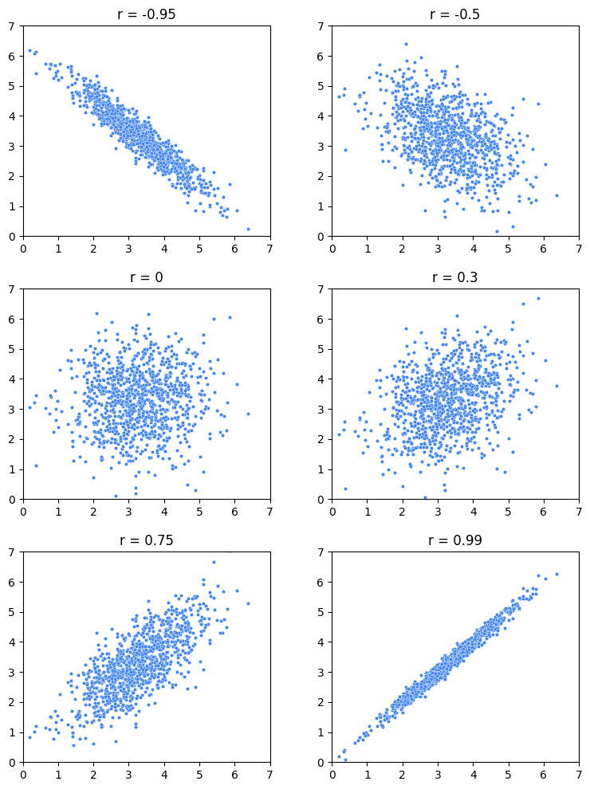
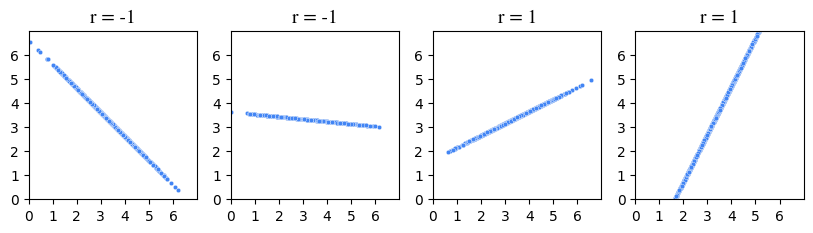
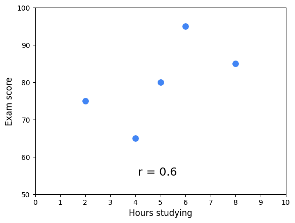
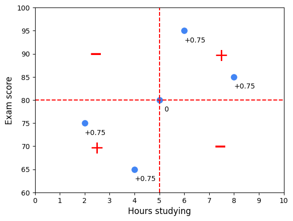
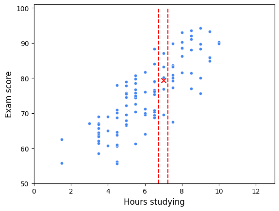
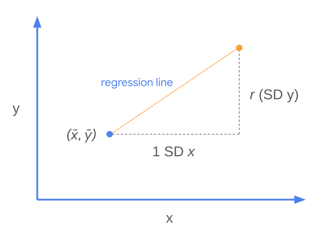
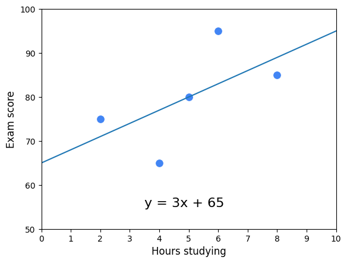
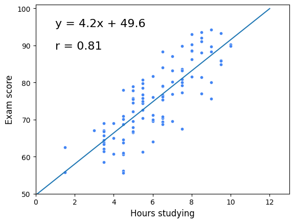

# Correlación e Intuición de la Regresión Lineal Simple

Hasta ahora ha aprendido que la **regresión lineal simple** estima la relación lineal entre una variable independiente $X$ y una variable dependiente continua $Y$. También ha aprendido sobre la estimación por **Mínimos Cuadrados Ordinarios (MCO)** para encontrar la recta de mejor ajuste.

En esta lectura se exploran:

- El significado de **correlación**
- El coeficiente de correlación **$r$**
- Cómo determinar la **ecuación de regresión**

---

# Correlación

La **correlación** mide cómo dos variables se mueven juntas.

- Si la correlación es fuerte, conocer una variable ayuda a predecir la otra.
- Si es débil, conocer una aporta poca información sobre la otra.

En regresión lineal, nos interesa la **correlación lineal**, es decir, cuando ambas variables cambian a un ritmo constante.

---

## Estadísticos básicos

Para una variable continua:

- **Media**: medida de tendencia central.
- **Desviación estándar (SD)**: medida de dispersión.

Cuando analizamos dos variables juntas, utilizamos el **coeficiente de correlación de Pearson ($r$)**.

---

## Coeficiente de correlación $r$

- Mide la fuerza de la relación lineal.
- Siempre está en el intervalo $[-1, 1]$.

Interpretación:

- $r > 0$: correlación positiva.
- $r < 0$: correlación negativa.
- $r = 0$: no hay correlación lineal.

Si $r = 1$ o $r = -1$, la relación es perfectamente lineal.

Importante: $r$ no indica la magnitud de la pendiente, solo la dirección y fuerza de la relación lineal.

La siguiente figura muestra gráficos de dispersión de datos bivariantes (bi = "dos", variate = "variables") en los que cada variable tiene la misma media y desviación típica y sólo varía el coeficiente de correlación

Observe que cuanto más se acerca r a -1 o 1, más lineales parecen los datos. Cuando r es exactamente 1 o exactamente -1, las variables están perfectamente correlacionadas y su gráfica es una recta. Cuando r es cero, no hay correlación entre las variables y, en este ejemplo, los datos aparecen como una nube informe de puntos.

Sin embargo, r sólo indica la fuerza de la correlación lineal entre las variables; no dice nada sobre la magnitud de la pendiente de la relación entre las variables, aparte de su signo. Por ejemplo, las variables con r=1 no le dirían si al aumentar X en uno Y aumentaría en 10, 100, 0,1 o algo más. Sólo le diría que puede estar seguro de que aumentaría. Este hecho se ilustra en la siguiente figura, donde aunque las pendientes de las rectas son todas diferentes, r sólo es -1 ó 1. Si la línea es perfectamente horizontal o perfectamente vertical, entonces r es indefinida. (Si te preguntas por qué, consulta la ecuación siguiente. Uno de los términos del denominador sería igual a cero, lo que haría que todo el denominador fuera igual a cero, lo que daría como resultado una solución indefinida)

---

# Cálculo de $r$

La fórmula poblacional es:

$$
r = \frac{\text{cov}(X,Y)}{(SD_X)(SD_Y)}
$$

Donde:

$$
\text{cov}(X,Y) = \frac{\sum_{i=1}^{n} (x_i - \bar{x})(y_i - \bar{y})}{n}
$$

Nota: Para muestras, se usa $n - 1$ en lugar de $n$.

---

## Interpretación intuitiva

- El **numerador (covarianza)** mide cómo varían conjuntamente $X$ e $Y$ respecto a sus medias.
  - Cuando este valor es positivo, sugiere que los valores altos de X tienden a asociarse con valores altos de Y, lo que indica una correlación positiva. Por el contrario, si el valor es negativo, sugiere que los valores altos de X tienden a asociarse con valores bajos de Y y viceversa, lo que indica una correlación negativa.
- El **denominador** normaliza el valor, haciendo que $r$ sea adimensional.
 

Otra forma equivalente de calcular $r$:
1. Convertir cada valor a unidades estándar.
2. Multiplicar las puntuaciones estandarizadas.
3. Calcular la media de esos productos.

---

## Ejemplo

Cinco estudiantes:

| Horas (X) | Nota (Y) | X en unidades estándar | Y en unidades estándar | Producto de unidades estándar|
|-----------|----------|------------------------|------------------------|------------------------------|
| 2 | 75 | -1.5 | -0.5 | 0.75 |
| 4 | 65 | -0.5 | -1.5 | 0.75 |
| 5 | 80 | 0 | 0 | 0 |
| 6 | 95 | 0.5 | 1.5 | 0.75 |
| 8 | 85 | 1.5 | 0.5 | 0.75 |

Resumen:

- $\bar{X} = 5$
- $SD_X = 2$
- $\bar{Y} = 80$
- $SD_Y = 10$
- $r = 0.6$

Interpretación: correlación positiva moderada.

Observa que la nube de puntos tiene una pendiente ascendente. Esto corresponde a que r es positivo. El coeficiente de correlación funciona como indicador de asociación porque utiliza el producto de la desviación de cada variable respecto a su media. Cuando el producto es positivo, significa que tanto el valor X como el valor Y están por debajo de sus medias respectivas (unidades estándar negativas) o por encima de sus medias respectivas (unidades estándar positivas). Varían conjuntamente. Sin embargo, cuando este producto es negativo, significa que uno de los valores está por encima de su media y el otro por debajo. Varían en direcciones opuestas respecto a sus respectivas medias.

La siguiente figura ilustra esta idea. La figura está dividida en cuadrantes. La línea vertical representa el valor X medio y la línea horizontal representa el valor Y medio. Cada punto está marcado con el producto de sus puntuaciones normalizadas (véase la tabla anterior). La media de estas puntuaciones es r. Si r es positivo, habrá más puntos en los cuadrantes positivos y viceversa.

---

# Regresión

Si no tuviera información adicional, la mejor predicción de una nota sería la media general.

Pero si conoce las horas estudiadas, puede estimar la media de quienes estudiaron esa cantidad.

La **recta de regresión** generaliza esta idea: estima el valor medio de $Y$ para cada valor de $X$.

Es una estimación de la tendencia central de $Y$ dado $X$.

He aquí un ejemplo que utiliza una muestra de 100 estudiantes con tiempos de estudio redondeados a la media hora más cercana. Supongamos que te dicen que un alumno estudió siete horas. Para calcular la nota del examen, una forma de minimizar el error es calcular la media sólo de los alumnos que estudiaron siete horas.

En este diagrama de dispersión, todos los alumnos que estudiaron siete horas se sitúan entre las dos líneas verticales. Su nota media del examen está representada por una X. La Regresión lineal amplía este concepto. Una recta de regresión representa el valor medio estimado de Y para cada valor de X, dados los supuestos y las limitaciones de un modelo lineal. En otras palabras, los valores medios reales de Y para cada X pueden no coincidir exactamente con la recta de regresión si la relación entre X e Y no es perfectamente lineal o si hay otros factores que influyen en Y y no están incluidos en el modelo. La recta de regresión intenta equilibrar estas influencias para encontrar una relación rectilínea que se ajuste lo mejor posible a los datos en su conjunto. Es una estimación de la tendencia central de Y, dado X.

---

# Ecuación de Regresión

Dos hechos clave:

1. El punto $(\bar{x}, \bar{y})$ siempre está en la recta.
2. Por cada aumento de 1 desviación estándar en $X$, se espera un aumento de $r$ desviaciones estándar en $Y$.

La siguiente figura ilustra cómo estos conceptos funcionan conjuntamente para determinar la recta de regresión.

---

## Pendiente

$$
m = r \frac{SD_Y}{SD_X}
$$

---

## Intercepto

Usando $y = mx + b$ y el punto $(\bar{x}, \bar{y})$:

$$
b = \bar{y} - m\bar{x}
$$

---

## Ejemplo con los cinco estudiantes

Datos:

- $\bar{X} = 5$
- $\bar{Y} = 80$
- $SD_X = 2$
- $SD_Y = 10$
- $r = 0.6$

### Paso 1: Pendiente

$$
m = 0.6 \cdot \frac{10}{2} = 3
$$

### Paso 2: Intercepto

$$
80 = 3(5) + b
$$

$$
b = 65
$$

### Ecuación final:

$$
y = 3x + 65
$$

Esta es la **regresión de Y sobre X**.

Esto se conoce como "la regresión de Y sobre X" Aquí está la recta de regresión para los 100 estudiantes:

---

# Puntos Clave

 Comprender los elementos fundamentales de la regresión lineal simple le ayudará a medida que continúe aprendiendo sobre métodos más complejos de análisis de regresión. Estos son algunos puntos clave que debe tener en cuenta:

- La correlación mide cómo dos variables se mueven juntas.
- $r$ cuantifica la fuerza de la relación lineal.
- $r \in [-1,1]$.
- La recta de regresión estima el valor medio de $Y$ dado $X$.
- La pendiente es:

$$
m = r \frac{SD_Y}{SD_X}
$$

- El punto $(\bar{x}, \bar{y})$ siempre está en la recta de regresión.

La regresión lineal simple es una de las herramientas fundamentales del análisis de datos y sirve como base para modelos más complejos.

## Autoevaluacion

### Rellene el espacio en blanco: La línea de mejor ajuste es la que mejor se ajusta a los datos minimizando alguna _____.

- [x] función de pérdida
- [ ] valores residuales
- [ ] función de regresión
- [ ] valores previstos

> La línea de mejor ajuste es la que mejor se ajusta a los datos minimizando alguna función de pérdida. Para encontrar la línea de mejor ajuste, es necesario medir el error, que es la diferencia entre los valores observados y los valores predichos generados por el modelo.

### ¿Cuál es la suma de las diferencias al cuadrado entre cada valor observado y el valor previsto asociado?

- [ ] Suma de los valores predichos al cuadrado
- [ ] Mínimos cuadrados ordinarios
- [ ] Mínimos cuadrados residuales
- [x] Suma de los residuos al cuadrado 

> La suma de los residuos al cuadrado es la suma de las diferencias al cuadrado entre cada valor observado y el valor previsto asociado. Los profesionales de los datos utilizan esta suma para captar un resumen del error total del modelo.

### ¿Qué indica el símbolo circunflejo o "sombrero" (^) cuando se utiliza sobre un coeficiente?

- [ ] El coeficiente es un valor de parámetro poblacional
- [ ] El coeficiente es un residuo
- [x] El coeficiente es una estimación o valor previsto
- [ ] El coeficiente es un valor "real" (no previsto)

Correcto