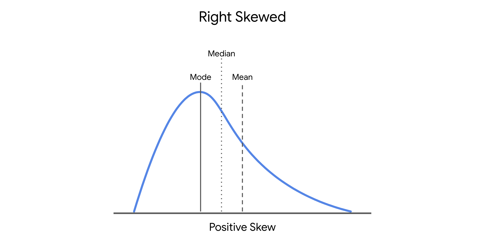

# Etapa de Análisis del Marco PACE: Supuestos de la Regresión Lineal Simple

En la etapa de **análisis** del marco PACE, la primera tarea en una regresión lineal simple es **comprobar los supuestos del modelo**. 

Además de los requisitos técnicos, también es importante considerar el **contexto empresarial**, lo cual se aborda en la fase de planificación.

Los **supuestos del modelo** son afirmaciones sobre los datos que deben cumplirse para justificar el uso de una técnica de modelado específica. Verificar que utilizamos el modelo adecuado para nuestros datos nos permite confiar en los resultados obtenidos.

Podemos entender los supuestos como el **puente entre la fase de análisis y la fase de construcción** del marco PACE. Es recomendable examinar estos supuestos antes de construir el modelo cuando sea posible. Sin embargo, algunos solo pueden comprobarse después de haber creado el modelo.

Las **visualizaciones de datos** son herramientas fundamentales para verificar estos supuestos, y Python facilita enormemente su generación.

---

# Los Cuatro Supuestos Clave de la Regresión Lineal Simple

1. **Linealidad**
   - Cada variable de predicción ($X_i$) está relacionada linealmente con la variable de resultado ($Y_i$).
2. **Normalidad**  
   - Los errores se distribuyen con normalidad.*
3. **Obsersabilodad independiente**
   - Cada observación del conjunto de datos es independiente.
4. **Homocedasticidad**  
    - La varianza de los errores es constante o similar en todo el modelo.*

\* Nota sobre errores y residuos

> En este curso se han utilizado indistintamente los términos "errores" y "residuos" en relación con la regresión. Usted puede ver esto en otros recursos en línea y materiales a lo largo de su tiempo como un profesional de datos. En realidad, hay una diferencia:

- Los residuos son la diferencia entre los valores predichos y los observados. Puede calcular los residuos después de construir un modelo de regresión restando los valores predichos de los valores observados.
- Los errores son el ruido natural que se supone que hay en el modelo.
- Los residuos se utilizan para estimar los errores al comprobar los supuestos de normalidad y homocedasticidad de la regresión lineal.

A continuación, se explica qué significa cada uno y cómo comprobarlo mediante visualizaciones.

---

## 1. Supuesto de Linealidad

Este es el supuesto más sencillo de comprobar.

La regresión lineal recibe su nombre porque, al representar los datos en un plano de coordenadas $(x, y)$, estos deberían aproximarse a una **línea recta**.


### Cómo comprobarlo

- Crear un **diagrama de dispersión**.
  - La variable independiente estaría en el eje x, y la variable dependiente estaría en el eje y.
- Verificar que los puntos estén agrupados alrededor de una línea recta.
  
Hay varias funciones de Python que se pueden utilizar para leer los datos y crear un gráfico de dispersión. Algunos paquetes utilizados para la visualización de datos son Matplotlib, seaborn y Plotly. La comprobación del supuesto de linealidad debe realizarse antes de construir el modelo.

```python
# Crear diagramas de dispersión por pares de datos 
sns.pairplot(chinstrap_penguins)
```


### Interpretación

- ✅ Si los puntos siguen aproximadamente una línea → el modelo es apropiado.
- ❌ Si parecen una nube aleatoria o una curva → el supuesto no se cumple y puede requerirse un modelo más complejo.

---

## 2. Supuesto de Normalidad

Este supuesto establece que los **residuos (errores)** del modelo se distribuyen normalmente.

Dado que se refiere a los residuos, **solo puede comprobarse después de construir el modelo**.

### Cómo comprobarlo

- Generar una **gráfica cuantilo-cuantil (QQ plot)** de los residuos.
- Observar si los puntos forman una línea diagonal recta.

#### Diagrama cuantil-cuantil

El diagrama cuantil-cuantil(diagrama Q-Q) es una herramienta gráfica utilizada para comparar dos distribuciones de probabilidad trazando sus cuantiles entre sí. Los profesionales de los datos suelen preferir los gráficos Q-Q a los histogramas para evaluar la normalidad de una distribución, ya que es más fácil discernir si un gráfico se ajusta a una línea recta que determinar en qué medida un histograma sigue una curva normal. Así es como funcionan los gráficos Q-Q cuando se evalúa la normalidad de los residuos de un modelo:

1. **Ordene los residuos**. Ordene sus n residuos de menor a mayor. Para cada uno, calcule qué porcentaje de los datos cae en o por debajo de este rango. Estos son los n cuantiles de los datos.

2. **Compara con una distribución normal**. Divide una distribución normal estándar en n+1 áreas iguales (es decir, córtala n veces). Si los residuos se distribuyen normalmente, el cuantil de cada residuo (es decir, qué porcentaje de los datos cae por debajo de cada residuo clasificado) se alineará estrechamente con las puntuaciones z correspondientes de cada uno de los n cortes de la distribución normal estándar (éstas se pueden encontrar en una tabla normal de puntuaciones z o, más comúnmente, utilizando software estadístico).

3. **Construya un gráfico**. Un gráfico Q-Q tiene los valores de cuantiles conocidos de una distribución normal estándar a lo largo de su eje x y los valores residuales ordenados por rango en su eje y. 

    Si los residuos se distribuyen normalmente, los valores de los cuantiles de los residuos se corresponderán con los de la distribución normal estandarizada, y ambos aumentarán linealmente. 

    Si primero estandariza sus residuos (conviértalos en puntuaciones z restando la media y dividiendo por la desviación típica), los dos ejes estarán en escalas idénticas y, si los residuos están distribuidos normalmente, la línea formará un ángulo de 45°. 

    Sin embargo, la normalización de los residuos no es un requisito de un gráfico Q-Q. En cualquier caso, si el gráfico resultante no es lineal, los residuos no están distribuidos normalmente.

En la figura siguiente, el primer gráfico Q-Q representa datos que se tomaron de una distribución normal. Forma una línea cuando se compara con los cuantiles de una distribución normal estándar. El segundo gráfico representa datos extraídos de una distribución exponencial. El tercer gráfico utiliza datos extraídos de una distribución uniforme. Observa cómo el segundo y el tercer gráfico no se adhieren a una línea.


### Interpretación

- ✅ Si los puntos siguen la línea diagonal → se asume normalidad.
- ❌ Si se desvían considerablemente → el supuesto puede no cumplirse.

#### Cómo codificar una gráfica Q-Q

Afortunadamente, no es necesario realizar manualmente los pasos descritos anteriormente. Existen bibliotecas informáticas que se encargan de ello. Una forma de crear un gráfico Q-Q es utilizar la biblioteca statsmodels. Si importa statsmodels.api, puede utilizar la función qqplot()directamente. 

El ejemplo siguiente utiliza los residuos de un objeto modelo statsmodels ols. El modelo hace una regresión de la longitud de las aletas de los pingüinos en la profundidad de su pico (Y en X). 

```python
import statsmodels.api as sm
import matplotlib.pyplot as plt

residuals = model.resid
fig = sm.qqplot(residuals, line = 's')
plt.show()
```


Y aquí hay un histograma de los mismos datos:

```python
fig = sns.histplot(residuals)
fig.set_xlabel("Residual Value")
fig.set_title("Histogram of Residuals")
plt.show()
```


---

## 3. Supuesto de Observaciones Independientes

Cada observación del conjunto de datos debe ser independiente de las demás.

### Cómo comprobarlo

- Analizar el contexto de recopilación de datos.
- Crear un gráfico de **valores ajustados vs. residuos**.

### Interpretación

- ✅ Si el gráfico muestra una nube aleatoria de puntos → independencia probable.
- ❌ Si aparece algún patrón → puede existir dependencia entre observaciones.

---

## 4. Supuesto de Homocedasticidad

La homocedasticidad significa **igual dispersión** de los residuos a lo largo de los valores de la variable dependiente.

### Cómo comprobarlo

- Utilizar el gráfico de **valores ajustados vs. residuos**.
- Verificar que exista **varianza constante**.

```python
import matplotlib.pyplot as plt

fig = sns.scatterplot(fitted_values, residuals)
fig.axhline(0)
fig.set_xlabel("Fitted Values")
fig.set_ylabel("Residuals")
plt.show()
```


### Interpretación

- ✅ Nube aleatoria sin patrón claro → se cumple el supuesto.
- ❌ Patrón en forma de cono u otro patrón visible → no se cumple el supuesto.

### Pregunta

#### La regresión lineal simple se basa en cuatro supuestos: linealidad, normalidad y observaciones independientes. ¿Cuál es el cuarto supuesto?

- [ ] Observaciones dependientes
- [x] Homoscedasticidad
- [ ] Observaciones independientes
- [ ] Heteroscedasticidad

> Los cuatro supuestos de la regresión lineal simple son linealidad, normalidad, observaciones independientes y homocedasticidad. La linealidad supone que cada variable de predicción Xi está relacionada linealmente con la variable de resultado Y. La normalidad supone que los valores residuales se distribuyen normalmente. La observación independiente supone que cada observación del conjunto de datos es independiente. Y la homocedasticidad supone que los valores tienen la misma varianza.


## Qué hacer si se incumple un supuesto

Ahora que ha revisado los cuatro supuestos y cómo comprobar si se incumplen, es el momento de discutir algunos pasos comunes que puede dar una vez que se incumple un supuesto. Tenga en cuenta que si transforma los datos, podría cambiar la interpretación de los resultados. Además, si estas soluciones potenciales no funcionan para sus datos, debe considerar probar un tipo diferente de modelo.

Por ahora, ¡concéntrese en algunos enfoques esenciales para empezar!

1. **Linealidad**

    - Transforme una o ambas variables, por ejemplo, tomando el logaritmo.

        - Por ejemplo, si estás midiendo la relación entre los años de educación y los ingresos, puedes tomar el logaritmo de la variable ingresos y comprobar si eso ayuda a la relación lineal.

2. **Normalidad**

    - Transforme una o ambas variables. Lo más habitual es tomar el logaritmo de la variable de resultado.

    - Cuando la variable de resultado está sesgada a la derecha, como los ingresos, la normalidad de los residuos puede verse afectada. Por lo tanto, tomar el logaritmo de la variable de resultado a veces puede ayudar con este supuesto.

    - Si transforma una variable, tendrá que reconstruir el modelo y volver a comprobar el supuesto de normalidad para estar seguro. Si el supuesto sigue sin cumplirse, tendrá que seguir resolviendo el problema.

    - 
  
3. **Observaciones independientes**

   - Tome sólo un subconjunto de los datos disponibles.

      - Si, por ejemplo, está realizando una encuesta y obtiene respuestas de personas del mismo hogar, sus respuestas pueden estar correlacionadas. Puede corregirlo manteniendo sólo los datos de una persona de cada hogar.

      - Otro ejemplo es la recogida de datos a lo largo de un periodo de tiempo. Supongamos que está investigando datos sobre el alquiler de bicicletas. Si recoge los datos cada 15 minutos, el número de bicicletas alquiladas a las 8:00 a.m. podría estar correlacionado con el número de bicicletas alquiladas a las 8:15 a.m. Pero, quizás el número de bicicletas alquiladas sea independiente si los datos se toman una vez cada 2 horas, en lugar de una vez cada 15 minutos.


4. **Homoscedasticidad**

    - Defina una variable de resultado diferente.

        - Si está interesado en comprender cómo se correlaciona la población de una ciudad con el número de restaurantes de una ciudad, sabrá que algunas ciudades están mucho más pobladas que otras. En ese caso, puede redefinir la variable de resultado como la relación entre la población y los restaurantes.

    - Transformar la variable Y.

        - Al igual que con los supuestos anteriores, a veces tomar el logaritmo o transformar la variable Y de otra forma puede solucionar inconsistencias con el supuesto de homocedasticidad.
---

# Consideraciones Finales

- Los cuatro supuestos de la regresión lineal simple son:
  - **Linealidad**
  - **Normalidad**
  - **Observaciones independientes**
  - **Homocedasticidad**
- Hay formas de trabajar con los datos que pueden corregir las violaciones de los supuestos del modelo.
- Cambiar las variables cambiará la interpretación
- Si se violan los supuestos, incluso después de transformar los datos, debería considerar otros modelos para sus datos.
  

No es necesario memorizar todo inmediatamente. El análisis de datos es un **proceso iterativo**. Puede volver a estos conceptos, verificar si los supuestos se alinean con los datos y continuar refinando el modelo.


